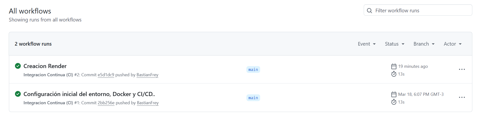
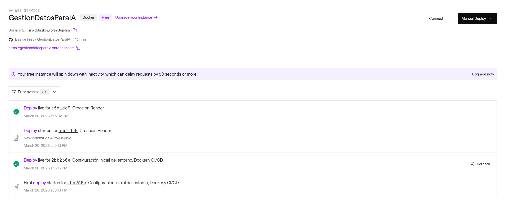
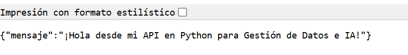

# 🚀 Gestión de Datos para IA - Entorno Técnico y CI/CD

Este repositorio documenta y almacena la configuración inicial de un entorno de desarrollo, contenerización y despliegue continuo (CI/CD). El proyecto está diseñado para alojar una API escalable que servirá como base para futuras integraciones con bases de datos y modelos de Inteligencia Artificial.

## 🎯 1. Objetivo de la Actividad
Desarrollar una heurística de trabajo reproducible y automatizada. El propósito es estructurar un entorno en la nube, dejando trazabilidad de todo el proceso en este repositorio, aplicando principios de **contenedorización, automatización y trabajo colaborativo**.

## 🧠 2. Explicación del Proceso y Decisiones Tecnológicas

Para cumplir con los requerimientos del encargo, se construyó un flujo de trabajo utilizando herramientas estándar de la industria. A continuación, se detalla qué hace cada una y para qué sirve en nuestro proyecto:

* **🐍 Desarrollo de la API (Python + FastAPI):** * **Qué se hizo:** Se creó el código base de una API RESTful en la carpeta `src/`.
  * **Para qué sirve:** Python es el lenguaje líder en el ecosistema de datos e IA. FastAPI nos permite levantar servicios web de altísimo rendimiento de forma sencilla. Esta API será el "cerebro" que conectará a los usuarios con nuestros futuros modelos de datos.

* **🐳 Contenerización (Docker):**
  * **Qué se hizo:** Se redactó un archivo `Dockerfile` con las instrucciones paso a paso para empaquetar la aplicación.
  * **Para qué sirve:** Docker crea una "caja" (contenedor) que incluye el sistema operativo, Python, y nuestra API. Esto garantiza que el proyecto funcione de manera idéntica en cualquier computador o servidor, eliminando el clásico problema de *"en mi máquina sí funciona"*.

* **⚙️ Integración Continua / CI (GitHub Actions):**
  * **Qué se hizo:** Se configuró el archivo de automatización `.github/workflows/ci-cd.yml`.
  * **Para qué sirve:** Cada vez que se sube nuevo código (`push`) a la rama principal, un robot de GitHub levanta un servidor temporal, instala todo y verifica que la aplicación no tenga errores. Esto nos da **trazabilidad y seguridad** antes de que el código llegue a producción.

* **☁️ Entrega Continua y Despliegue / CD (Render):**
  * **Qué hicimos:** Se conectó este repositorio directamente con la plataforma en la nube Render.
  * **Para qué sirve:** Render toma nuestro contenedor Docker y lo publica en internet automáticamente. Nos proporciona una URL pública y operativa sin tener que configurar servidores manualmente.

* **🗄️ Base de Datos (Supabase - NO SE HIZO):**

## 📂 3. Estructura del Repositorio

Para mantener el orden y las buenas prácticas, el proyecto se divide así:

* `.github/workflows/`: Contiene `ci-cd.yml` (el flujo de automatización).
* `src/`: Carpeta principal con el código fuente.
  * `main.py`: La lógica central de la API.
  * `requirements.txt`: El listado de dependencias de Python.
* `Dockerfile`: La receta para construir el contenedor.
* `.env.example`: Plantilla de seguridad que muestra qué variables de entorno necesita la app sin revelar contraseñas reales.
* `.gitignore`: Archivo que evita subir archivos temporales, contraseñas o entornos locales al repositorio público.
* `docs`: Carpeta para almacenar imagenes de evidencia.

## 💻 4. Cómo ejecutar este proyecto en local

Si otro desarrollador desea clonar y probar este entorno en su máquina, debe seguir estos pasos:

1. Clonar el repositorio: `git clone <https://github.com/BastianFrey/GestionDatosParaIA.git>`
2. Crear un entorno virtual de Python: `python -m venv venv`
3. Activar el entorno virtual (Windows): `.\venv\Scripts\activate`
4. Instalar las dependencias: `pip install -r src/requirements.txt`
5. Levantar el servidor local: `uvicorn src.main:app --reload`

## 🌐 5. Entorno Operativo y Evidencias de Ejecución

El ciclo de Integración y Entrega Continua (CI/CD) ha sido completado con éxito. La aplicación se encuentra actualmente contenerizada y viva en la nube.

* 🔗 **URL de la API Operativa en Render:** [https://gestiondatosparaia.onrender.com](https://gestiondatosparaia.onrender.com)

### Evidencias Fotográficas del Despliegue

**1. Integración Continua (Verificación exitosa en GitHub Actions):**

**2. Entrega Continua (Despliegue exitoso en Render):**

**3. Prueba en vivo de la aplicación:**
